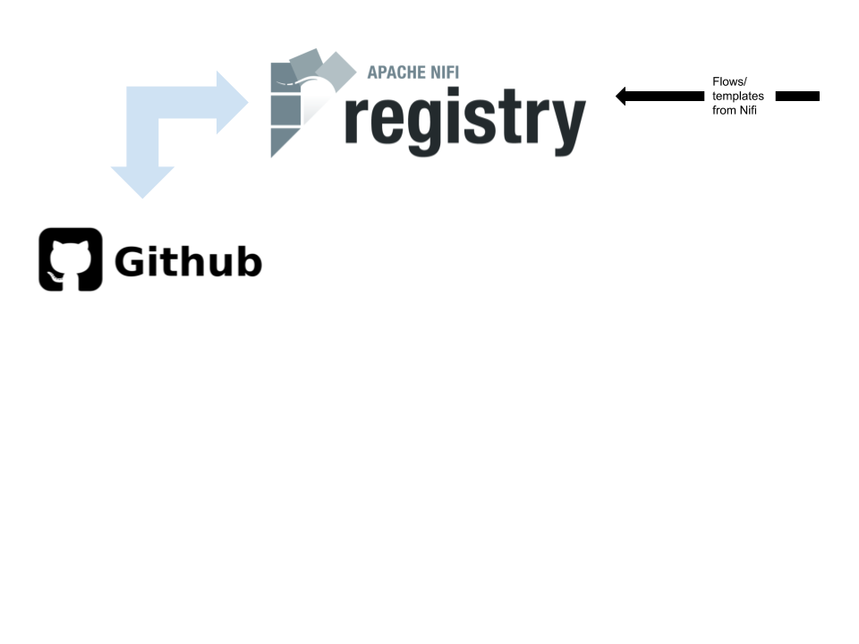

# NiFi Registry with GIT version control integration

This example deploys a NiFi Registry container with git integration (Github). 

The variables below define the GIT configuration for NiFi Registry: 

| Variable   |  Default value |Defined from CLI | Description |
| ------------- | ------------- | ------------- | ------------- |
| `git_remote_url`  | " "  | Yes |URL of the remote git repository. Use HTTPS. |
| `git_checkout_branch`  | " "  | Yes| Branch to checkout and track.|
| `git_flow_storage_directory`  | /opt/nifi-registry/flow-storage  | No| Default value is set by image, original default value was "./flow-storage". This variable is used in clone script as a destination directory for clone. It is also used in NiFi Registry configuration.|
| `git_remote_to_push`  | origin  | No |This variable is used in clone script to set origin name using `-o, --origin <name> use <name> instead of 'origin' to track upstream`. It is also used in NiFi Registry configuration.|
| `git_access_user`  | " "  | Yes | GitHub Username |
| `git_access_password`  | " "  | Yes | [Personal token from GitHub](https://docs.github.com/en/github/authenticating-to-github/creating-a-personal-access-token)|
| `git_user_name`  | nifi-registry  | No | Developer|
| `git_user_email`  | nifi-registry@localhost  | No | Developer email|

The variables marked with `Yes` in the column `Defined from CLI` must be pass as arguments from the command line.
The variable names have been abbreviated, such as:

| Variable | Abbreviated parameter <br>name on CLI |
| ------------- | ------------- | 
|`git_remote_url` | `repo` |
|`git_checkout_branch`  | `branch` |
|`git_access_user`  | `user` |
|`git_access_password`  | `token` |

Example with description of the parameters:
```bash
make up repo=<GitHub-repository> branch=<branch to checkout and track> user=<GitHub username> token=<personal token from GitHub> 
```

Example of use:
```bash
make up repo=https://github.com/hannemariavister/versioned_flows.git \ 
        branch=master \
        user=hannemariavister \ 
        token=thisisnotmypersonaltoken  
```

(NOTE, in later releases we would let our users have the option to define these variables directly in an example or from command line, which could be a good feature for testing purpose.)

## Secrets & Credentials 
The GitHub user and GitHub personal token (sent as parameters by respectively `user` and `token` from CLI) 
are store as `git_access_user` and `git_access_password` and put `/secret/data/github` inside Vault.

To get the `git_access_user` and `git_access_password` from Vault you can login to the [Vault-UI](http://localhost:8200/) with token `master` and reveal 
the `git_access_user` and `git_access_password` in /secret/github. 
Alternatively, you can ssh into the vagrant box with `vagrant ssh`, and use the vault binary to get the `git_access_user` and `git_access_password`. See the following commands:
```
# get git_access_user
vault kv get -field='git_access_user' secret/github

# get git_access_password
vault kv get -field='git_access_password' secret/github
```

## Consul Key Value Store
The `repo` and `branch` are also sent as parameters from CLI. We use Consul Key Value Store for storing these variables. 

To get the `repo` and `branch` from Consul visit [Consul-UI](http://localhost:8500/ui/dc1/kv).
Alternatively, you can ssh into the vagrant box with `vagrant ssh` , and use the consul binary to get the `repo` and `branch`. See the following commands:
```
# get repo
consul kv get github/repo

# get branch
consul kv get github/branch
```



Image: https://hub.docker.com/r/michalklempa/nifi-registry <br />
Source code: https://github.com/michalklempa/docker-nifi-registry/


